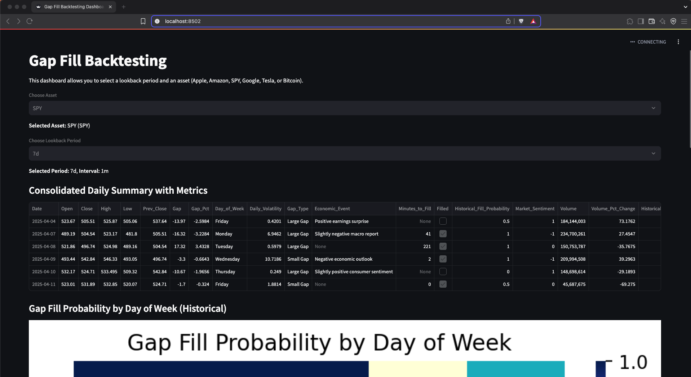

# Gap Fill Strategy for Options Trading Backtesting Dashboard


An interactive dashboard built with [Streamlit](https://streamlit.io/) that enables comprehensive backtesting of a gap fill strategy for options trading (and equities). This project integrates historical data retrieval, statistical gap analysis, visualization, and machine learning predictions to help quantify gap fill probabilities and predict next-day market metrics. It demonstrates a deep understanding of market microstructure and quantitative strategy development—ideal for junior analysts or professionals in quantitative finance.

---

## Table of Contents

- [Overview](#overview)
- [Key Features](#key-features)
- [Setup and Installation](#setup-and-installation)
  - [Clone the Repository](#clone-the-repository)
  - [Create a Virtual Environment](#create-a-virtual-environment)
  - [Install Dependencies](#install-dependencies)
  - [Configure Environment Variables](#configure-environment-variables)
- [Running the Dashboard](#running-the-dashboard)
- [How It Works](#how-it-works)
  - [Data Acquisition and Preparation](#data-acquisition-and-preparation)
  - [Gap Analysis and Metrics Calculation](#gap-analysis-and-metrics-calculation)
  - [Visualization and Dashboard Interactivity](#visualization-and-dashboard-interactivity)
  - [Machine Learning Predictions](#machine-learning-predictions)
- [Value Provided](#value-provided)
- [Demo](#demo)
- [Conclusion](#conclusion)

---

## Overview

The Gap Fill Strategy Backtesting Dashboard is designed to evaluate the performance of a gap fill trading strategy for options trading and equity markets. Users can select a lookback period and an asset from a curated list, and then explore detailed daily gap analysis including:
- Gap size, gap percentage, and intraday volatility  
- Historical fill probability by day of the week  
- Volume trends and VIX information for context  

Additionally, the dashboard uses a machine learning model (Random Forest with multi-output regression) to predict next-day price changes, gap fill probability, volume percentage change, and time to fill—providing actionable insights for traders.

---

## Key Features

- **Historical Data Retrieval:**  
  Fetches data for popular assets (Apple, Amazon, SPY, Google, Tesla, Bitcoin) via [yfinance](https://pypi.org/project/yfinance/).

- **Gap Analysis Metrics:**  
  Computes daily summaries including open/close, gap, gap percentage, daily volatility, and classifies gaps as small or large. Merges additional market data such as VIX values for sentiment analysis.

- **Visualizations:**  
  Interactive dashboards display key metrics, including a heatmap of gap fill probability by day of the week and a consolidated daily summary table.

- **Next Day Predictions:**  
  Uses historical data to predict next trading day metrics and the ML model generates forecasts for price changes, gap fill probability, volume changes, and minutes to fill.

- **Machine Learning:**  
  Implements a multi-output Random Forest regressor to capture relationships between daily market statistics and future performance, with error metrics provided for evaluation.

- **AI Integration:**  
  (Optionally) Uses OpenAI API for extended analysis or insights, showcasing integration of cutting-edge AI with quantitative strategies.

---

## Setup and Installation

### Clone the Repository

Clone the repository from GitHub:

```bash
git clone https://github.com/Juleshaydn/gap_fill_strategy_options
cd gap_fill_strategy_options

pip install -r requirements.txt
streamlit run main.py
